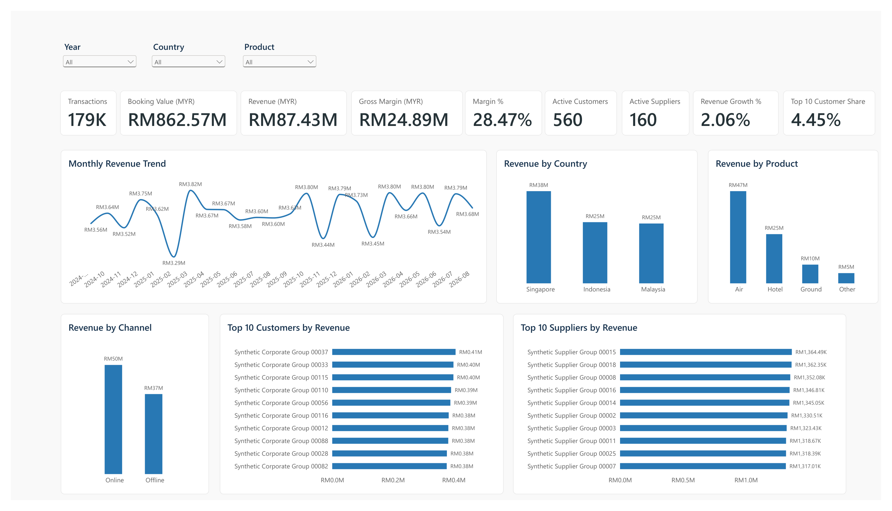
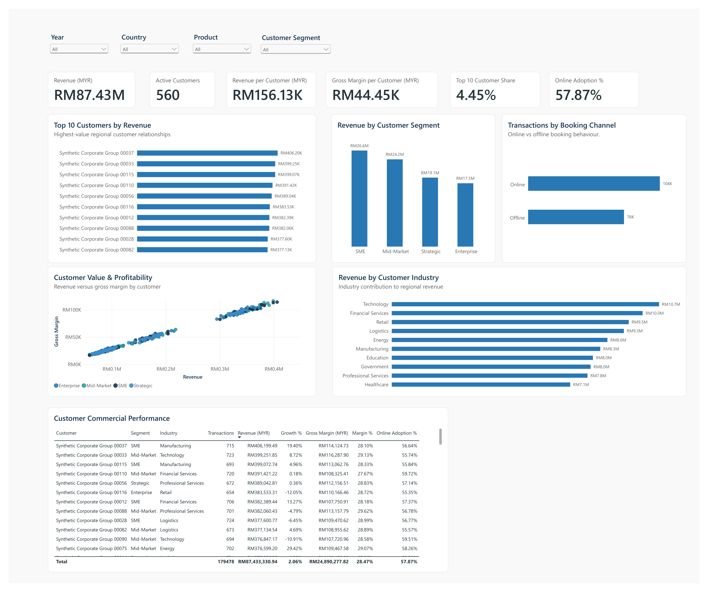
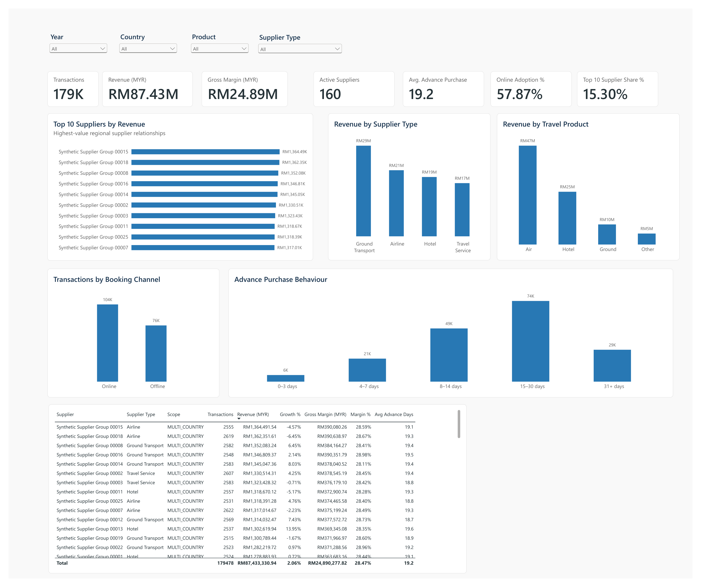
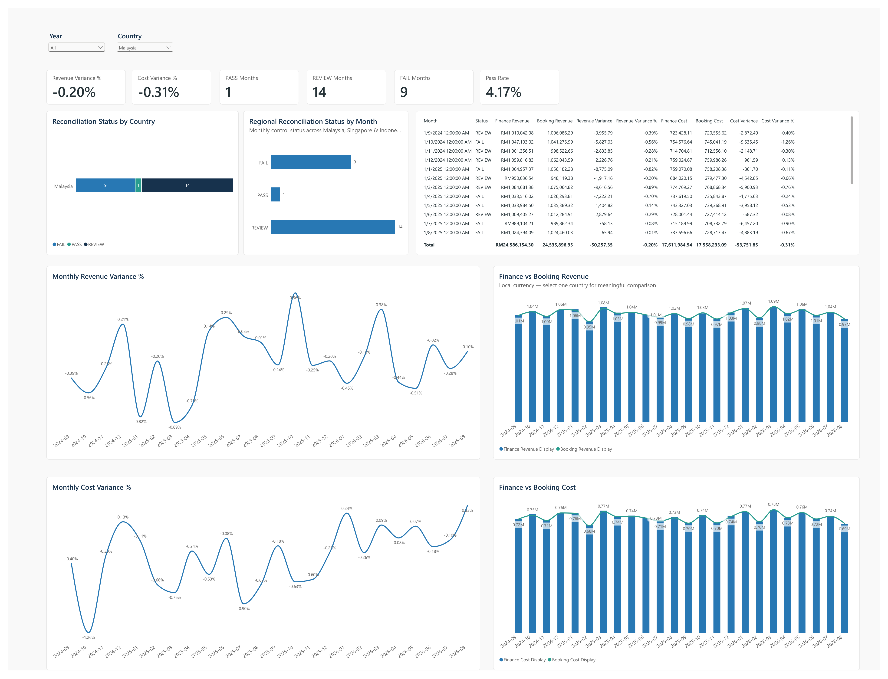
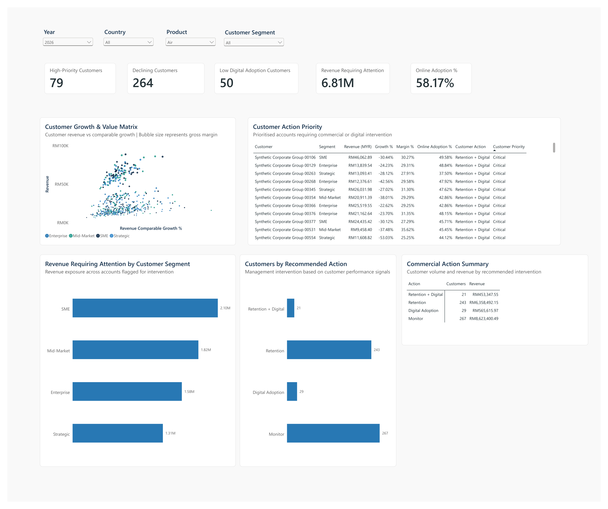

# Regional Travel Performance Analytics

An independent synthetic portfolio project demonstrating how regional travel data can be transformed into trusted business performance insights and management actions across Malaysia, Singapore, and Indonesia.

> **Disclaimer:** This project uses entirely synthetic data and assumptions. It does not represent Peter Stuyvesant Travel's actual systems, customers, suppliers, KPIs, financial performance, operations, or business results.

## Business Problem

Regional management may receive booking, customer, supplier, and finance data from different markets with different structures, terminology, and data-quality conditions.

The central question explored in this project is:

> **How can regional leadership obtain consistent, trusted, and actionable performance insight across markets and turn it into better business decisions?**

The project therefore focuses on creating a common regional performance framework rather than simply producing dashboards.

## Business Questions

The analytical framework is designed to help management answer questions such as:

- How is regional revenue and gross margin performing?
- Which countries, products, and booking channels contribute most?
- Which customers require commercial attention?
- How concentrated is revenue across customers and suppliers?
- How strong is online booking adoption?
- Which suppliers are strategically important?
- Can booking-system figures be reconciled with finance records?
- Where should management prioritise retention or digital-adoption actions?

## Analytical Approach

The project follows a simple management-information journey:

**Regional Source Data -> Data Quality & Standardisation -> Regional Master Data -> Finance Reconciliation -> Analytical Model -> Trusted KPIs -> Power BI -> Management Insights -> Actions**

The synthetic environment deliberately begins with different country data structures and terminology. These are then standardised into a common regional analytical model.

## Project Scope

- **Markets:** Malaysia, Singapore, Indonesia
- **Synthetic period:** September 2024 to August 2026
- **Regional staging input:** 180,090 records
- **Accepted analytical records:** 179,478
- **Quarantined records:** 612
- **Regional customers:** 560
- **Regional suppliers:** 160

The project includes data-quality controls, regional customer and supplier mapping, finance reconciliation, KPI calculations, commercial analytics, and management reporting.

## Power BI Management Dashboard

The final Power BI report contains five management views.

### 01 - Executive Overview

Provides a regional management view of revenue, booking value, gross margin, comparable revenue growth, country performance, product and channel mix, customer and supplier concentration, and regional performance trends.

### 02 - Customer & Commercial

Focuses on customer revenue and profitability, segmentation, revenue concentration, booking-channel behaviour, online adoption, customer value, and commercial performance.

### 03 - Supplier & Travel Performance

Focuses on supplier performance and concentration, travel-product performance, booking-channel behaviour, advance-purchase patterns, and travel programme indicators.

### 04 - Finance & Data Quality

Provides a control layer covering finance-to-booking reconciliation, revenue and cost variance, PASS / REVIEW / FAIL monitoring, and monthly reconciliation trends.

Absolute finance-versus-booking comparisons are intentionally evaluated at a single-country level because the underlying source values are in local currencies.

### 05 - Opportunities & Actions

Moves beyond reporting by converting customer performance signals into management interventions.

Example action categories include:

- **Retention + Digital**
- **Retention**
- **Digital Adoption**
- **Monitor**

The objective is to demonstrate how analytical signals can be converted into prioritised commercial actions.

## Dashboard Preview

### Executive Overview



### Customer & Commercial



### Supplier & Travel Performance



### Finance & Data Quality



### Opportunities & Actions



The complete five-page dashboard is available here:

[View the full Power BI dashboard PDF](powerbi/Regional_Travel_Performance_Analytics_Interview.pdf)

## Data & Analytics Flow

```text
Country Source Data
        |
        v
Raw Profiling
        |
        v
Data Quality
        |
        v
Standardisation
        |
        v
Customer & Supplier Master Data
        |
        v
Finance Reconciliation
        |
        v
Analytical Model
        |
        v
KPI Layer
        |
        v
Power BI
        |
        v
Management Insights
        |
        v
Recommended Actions
```

## Key Capabilities Demonstrated

- Regional business-performance analytics
- KPI standardisation and governance
- Cross-market data standardisation
- Data-quality controls
- Customer and commercial analytics
- Supplier and travel analytics
- Finance reconciliation
- Dimensional modelling
- Power BI management reporting
- Commercial opportunity identification
- Translation of insights into management actions

## Technology

The project uses a deliberately practical local analytics stack:

- Python 3.12
- pandas / NumPy
- Faker
- PyArrow / Parquet
- DuckDB
- SQL
- Pandera
- pytest
- Power BI
- Power Query
- DAX
- Git / GitHub

The technology supports the analytical process; it is not the primary purpose of the project.

## Repository Structure

```text
regional-travel-performance-analytics/
|-- config/          Project configuration
|-- data/            Synthetic source, reference, and processed data
|-- docs/            Business, KPI, quality, and governance documentation
|-- src/             Python processing and analytical logic
|-- sql/             SQL transformations and analytical queries
|-- tests/           Automated validation tests
|-- powerbi/         Power BI portfolio output
|-- presentation/    Interview/presentation material
|-- README.md        Project overview
```

## Management Perspective

The project is designed around the following decision-making journey:

**Business Question -> KPI -> Trusted Data -> Analysis -> Insight -> Recommendation -> Action -> Measurable Outcome**

The dashboard is therefore not treated as the final output. The intended final output is a better-informed management decision and an action whose outcome can subsequently be measured.

## Portfolio Context

This project was independently developed for professional portfolio and interview-preparation purposes.

It was not commissioned by Peter Stuyvesant Travel and does not use or claim access to any internal company data, architecture, systems, customers, suppliers, or financial information.